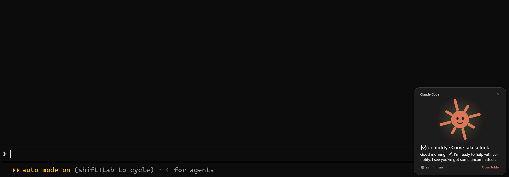

# cc-notify

Animated desktop notifications for [Claude Code](https://code.claude.com/docs/en/overview).

[](LICENSE)
[](https://code.claude.com/docs/en/overview)




A little Claude buddy pops up when a task finishes, fails, runs low on context, or needs your permission, and you can answer **Allow / Deny** right from the popup. Nothing extra to install.

## Features

| When | Popup |
| --- | --- |
| Turn finishes | First line of the answer, duration, tool count, branch |
| Turn ends in an error | What went wrong, duration, tool count, branch |
| Tool fails | The error (at most one every 10 s) |
| Permission needed | The command, with **Allow** / **Deny** buttons (Windows) |
| Claude is waiting on you | Claude Code's own reminder |
| Context fills up | At 80% and 90%, and again after a compact |
| Session starts | Project and branch |

- **Answer from the popup**: on Windows, **Allow** and **Deny** answer the permission prompt directly. Closing the popup leaves the question to the terminal.
- **Four languages**: English, 繁體中文, 简体中文 and 日本語, or `auto` to follow your system language.
- **Mute when you need quiet**: mute for a while, or turn notifications off until you turn them back on.

## Requirements

- Claude Code **2.1.288** or later. Function hooks are in early access and the API may change between releases.
- Platforms:

  | Platform | Popup | Status |
  | --- | --- | --- |
  | Windows 10 / 11 | Animated WPF card (built in) | Tested |
  | macOS | `osascript` notification | Untested |
  | Linux | `notify-send` | Untested |

  Where no desktop notifier is found, cc-notify falls back to Claude Code's in-app toast.

## Installation

### From the plugin marketplace

```
/plugin marketplace add xd3an/cc-notify
/plugin install notify@cc-notify
```

Restart Claude Code, then try `/notify test all`.

### From source

```bash
git clone https://github.com/XD3an/cc-notify.git
claude --plugin-dir ./cc-notify
```

Loaded this way, Claude Code watches the folder and reloads the plugin whenever you save.

## Usage

### Commands

```
/notify                 status and usage
/notify test [all]      sample popup(s), even while muted
/notify mute [1h]       mute for a while (30m, 2h, ...); 1h by default
/notify off             turn off until /notify on
/notify on | unmute     turn back on
/notify lang <code>     auto, en, zh-TW, zh-CN, ja
```

### Settings

Set these in the `/plugin` menu.

| Setting | Default | |
| --- | --- | --- |
| `language` | `en` | `en`, `zh-TW`, `zh-CN`, `ja`, or `auto` to follow your system language |
| `contextWarning` | `80` | Context % that triggers a warning; `0` turns it off |
| `permissionButtons` | `true` | Allow / Deny on the Windows popup |

## Development

### Project structure

```
.claude-plugin/plugin.json        Plugin manifest and settings
.claude-plugin/marketplace.json   Marketplace listing
hooks/hooks.json                  Points to the hooks module
hooks/register.ts                 Hooks: when to notify, /notify, permission answers
assets/popup.ps1                  The Windows popup (WPF)
assets/*.png                      The buddy's pictures for each kind of popup
notify.test.ts                    Plugin tests
```

### Checks and tests

```bash
claude plugin validate .
claude plugin test .
```

## Contributing

Tried it on macOS or Linux? Issues and pull requests are welcome. Please run `claude plugin validate .` and `claude plugin test .` before opening a PR.

## License

[MIT](./LICENSE)
